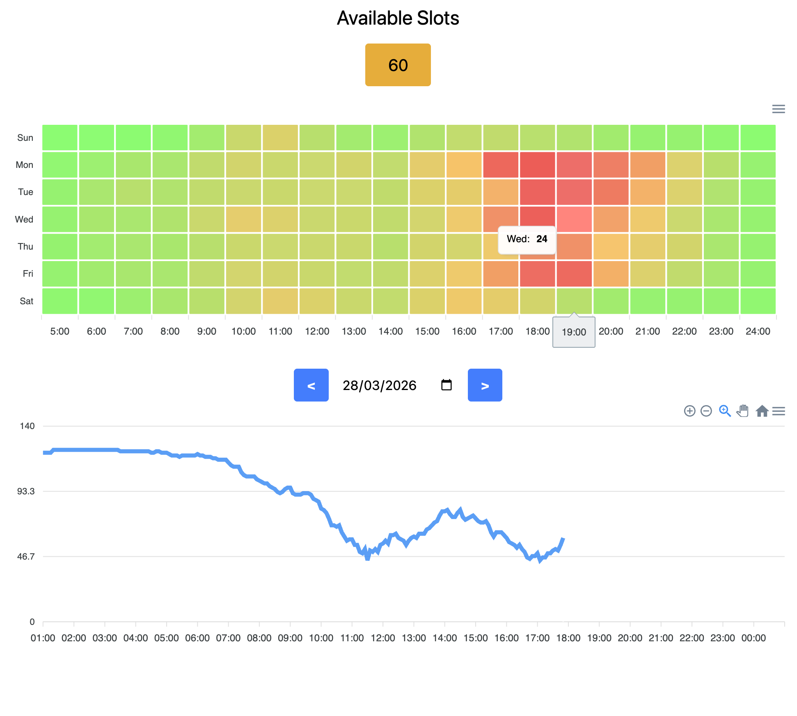

# 🏋️ Simple Gym Dashboard 🏋️

This repository contains a .NET project to track the number of free spots available in gyms.

Right now, I implemented the client + tracking only for gym apps using the "Wellness in Cloud" system.

*Disclaimer: the client library to wellness in cloud API is an unofficial, independent project used for educational purposes, and not affiliated with the developers of Wellness in Cloud; use at your own risk*

## Rationale

My gym application (based on Wellness in Cloud) provides instant availability data, but doesn't show any aggregated data. 

I wanted to see which times were better to work out, so I created this dashboard!

If you have a gym using the Wellness in Cloud backend and have the same necessity, feel free to deploy the app container for yourself.

## Features

The dashboard shows the seat availability in the selected gym, along with occupoancy charts for the week (hourly) and for the day.

The availability data is updated every 5 minutes.

## Local Development

### Environment Setup
The application needs a PostgreSQL database to work.

There is a `docker-compose.yml` file that can be used for local development.

### Application Setup
See the docs to:
- [Setup the encryption keys](docs/encryption.md)
- [Add a Gym](docs/gym-setup.md).