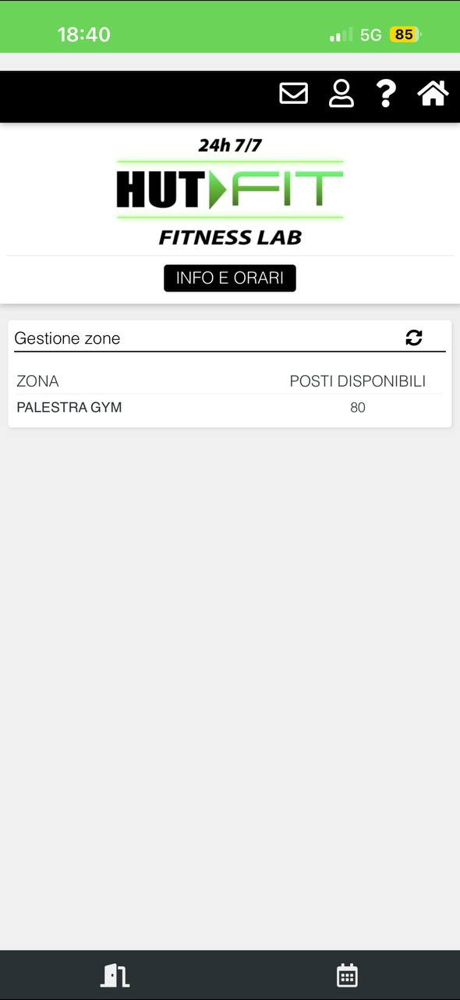

# Gym API Setup

This document highlight how to setup the gym API credentials for the dashboard.

The API lives on the wellness in cloud's servers, in particular on their mobile gateway.

Each gym (or gym group/company) has its own tenant, with a different api prefix (e.g. usually in `Wic_<gym-brand>` format). 

## How do I know if my gym is compatible?

If your gym app looks like the screen below, it might be compatible with the dashboard.

To be sure, go to the next step (find the tenant).



## How to find the tenant prefix?

To find the api prefix, you need to sniff the app traffic to watch the URLs called.

TODO

## Credentials encryption

The gym credentials (password) are stored encrypted in AES and encoded in base64 inside the database.

The AES parameters (key and iv) need to be configured using .NET `appsettings`. 

In particular, in `appsettings.<Environment>.json` you can set them like this:

```
"Encryption": {
    "Key": "your-key", 
    "InitializationVector": "your-iv"
},
```

for production deployment you can set them from the environment variables `Encryption__Key` and `Encryption_IV`.


## Creating the gym

For now, gyms are directly created in the db, by adding a row to the `Gym` table.

```
INSERT INTO public."Gym"
("Name", "Username", "Password", "ApiPrefix")
VALUES('Gym Name', '<user-email>', '<user-psw-encrypted>', '<api-prefix>');
```

Where:
- `<user-email>`: the username/email used to access your gym app
- `<user-psw-encrypted>`: your password, encrypted using the configured encryption key/iv and converted in base64
- `<api-prefix>`: the api prefix found in the previous steps
